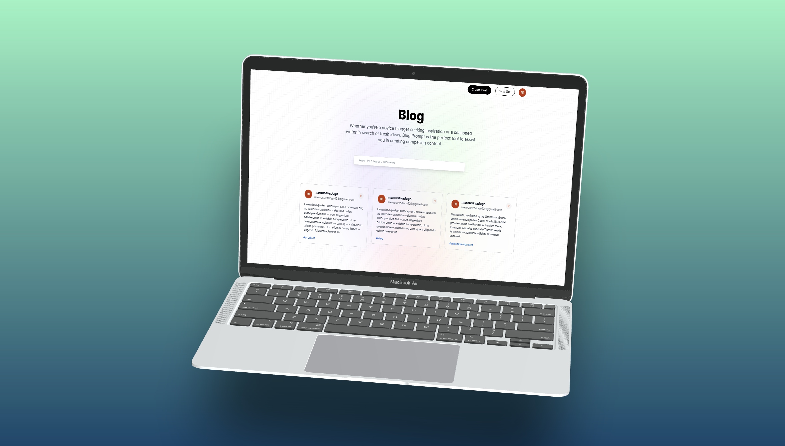
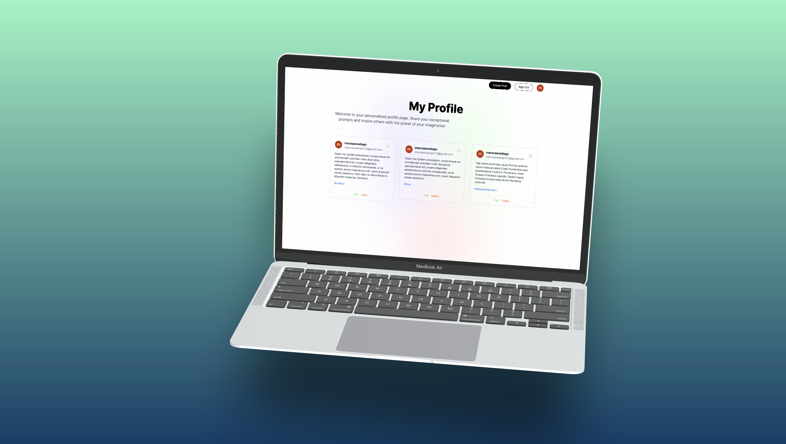

## Building a Fullstack Blog App with React, NextJS, TailwindCSS & MongoDB

Blog App  Full Stack app development with Next.js 13, React, Tailwind, and MongoDB.

## About this Repository

# Features:
⚙️ 💾 Environment, Typescript, NextJS Setup

MongoDB
Authentication with NextAuth, Google
Full responsiveness on all pages
Cookie based authentication
API and Controllers creation
Detail-oriented effects and animations using TailwindCSS
React SWR data fetching

🛰️ 🌐 🗄 📡 Technologies
Next 13
React
Tailwind
MongoDB

🔐 Setup .env file
GOOGLE_ID=

GOOGLE_CLIENT_SECRET=

MONGODB_URI=

NEXTAUTH_URL=

NEXTAUTH_URL_INTERNAL=

NEXTAUTH_AUTH_SECRET=

# Screenshot

